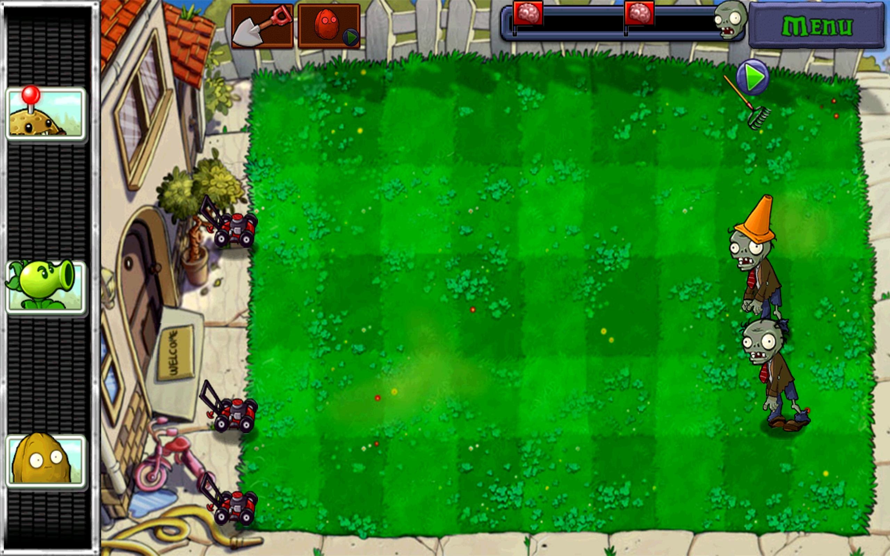
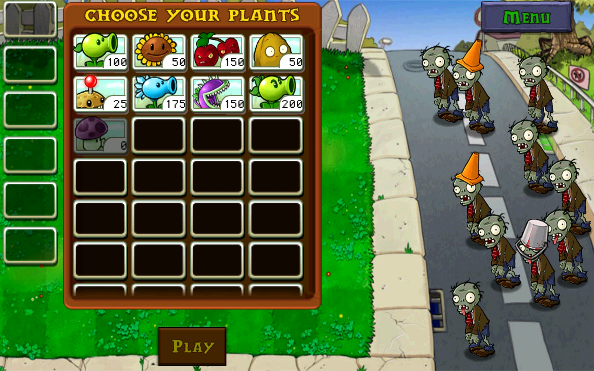

# 2025 OOPL Final Report

# 組別資訊

- **組別**：第二組  
- **組員**：黃台茗、陳昌右  
- **復刻遊戲**：植物大戰殭屍  

# 專案簡介

### 遊戲簡介

 《植物大戰殭屍》（Plants vs. Zombies）是由PopCap Games於2009年推出的一款塔防策略遊戲。玩家需在自家庭院中種植各種功能各異的植物，如向日葵、豌豆射手與堅果牆，抵禦一波波來襲的殭屍。遊戲中場景多變，從白天草地到夜晚墓地，還有泳池與屋頂，考驗玩家的佈局策略與應變能力。每種殭屍也有不同特性，玩家需靈活運用植物組合應對。遊戲畫風幽默可愛、音樂輕快，玩法簡單卻富挑戰性，自推出以來廣受玩家喜愛，成為塔防類遊戲的經典代表之一。

本組專案中，共計完成10關，場景皆為白天，並總共實現8種植物及5種殭屍，與原版遊戲不同的點有4點，第一點為關卡，原版的第5關及第10關設計為如圖一的方式放置植物，同時會有讓堅果牆滾動的部分，礙於時間因素且與其他關卡差異性較大，因此本組改成於其他關卡相同的遊玩模式；第二點為植物放置冷卻時間，在原版中各個植物存在放置後的冷卻時間(亦稱為CD時間)，且有動畫的呈現，但本組並未實現這個部分，因此在植物放置完後，只要太陽數量足夠，即可再放置同種植物；第三點為植物選擇，在原版遊戲當中，當進入第8關後，可以挑選自己要帶哪6種植物上陣，如圖二所示，但本組認為這項功能並非為主要需要完成的項目，因此並未撰寫；第四點則為雪豆造成的效果，原版為當殭屍被雪豆擊中會降速，但本組改成當一定秒數內，被擊中一定次數，會使其停止移動固定秒數後，才會恢復。

### 圖一

### 圖二

# 組別分工

### 陳昌右負責：

- 所有植物、殭屍、割草機、鏟子程式碼
- 各種碰撞箱檢測
- 各關殭屍編排、關卡選擇介面
- 遊戲暫停介面撰寫、作弊模式撰寫

### 黃台茗負責：

- 關卡建立、關卡遊玩限制、作弊模式優化
- 遊戲起始介面、按鈕程式碼、架構調整
- PTSD 調整、背景圖建立、太陽數值顯示

# 遊戲介紹

### 遊戲目標

玩家的目標是運用策略在庭院的草坪上種植各式植物，以抵禦並消滅所有來襲的殭屍，成功保衛家園。

### 核心玩法

1. **收集太陽**
2. **種植植物**
3. **抵禦殭屍**

### 特殊規則與修改

- **關卡模式**：皆為標準草坪，不含小遊戲
- **植物選擇**：系統指定植物
- **雪豆效果**：擊中後可暫停殭屍移動

## 植物資訊（共8種）

| 名稱         | 功能       | 描述摘要 |
|--------------|------------|----------|
| 向日葵       | 生產太陽   | 核心資源生產植物 |
| 豌豆射手     | 直線攻擊   | 初期主要火力 |
| 堅果牆       | 防禦/阻擋 | 銅牆鐵壁保護前線 |
| 櫻桃炸彈     | 範圍爆炸   | 消滅周圍 3x3 殭屍 |
| 雪豆射手     | 攻擊+控場 | 命中次數可冰凍殭屍 |
| 食人花       | 秒殺       | 吞下一格殭屍後進入冷卻 |
| 連發射手     | 雙倍火力   | 每次發射兩顆豌豆 |
| 馬鈴薯地雷   | 陷阱       | 延遲啟動的爆炸陷阱 |

## 殭屍資訊（共5種）

| 名稱             | 特性     | 描述摘要      |
|------------------|----------|-----------|
| 普通殭屍         | 慢、血少 | 基礎敵人      |
| 交通錐殭屍       | 中血量   | 有路障保護     |
| 鐵桶殭屍         | 高血量   | 有鐵桶保護     |
| 撐竿跳殭屍       | 快、可跳 | 可跳過植物闖入陣地 |
| 旗幟殭屍         | 波次提示 | 宣告大量敵人來襲  |

## 特殊規則與修改
### 關卡模式： 
所有10個關卡的遊戲模式均為標準的草坪佈陣玩法，不包含原版遊戲中特殊的滾動堅果牆等小遊戲關卡。
### 植物選擇： 
遊戲會根據關卡進度自動解鎖並分配可用的植物，玩家無需在關卡開始前手動挑選植物陣容。
### 雪豆效果： 
「雪豆」的攻擊效果經過修改。當殭屍在一定時間內被雪豆擊中特定次數後，將會被「冰凍」，暫時停止移動數秒，之後才會恢復行動。此效果取代了原版遊戲中的持續減速效果。
## 勝利條件
成功抵禦住關卡內所有波次的殭屍攻擊，即可順利通關。完成全部10個關卡的挑戰，即為最終勝利！
## 遊戲畫面

### 初始畫面(點擊開始冒險模式開始遊戲，按下esc可結束遊戲)

### 關卡選擇(點擊LEVEL可選擇關卡，鍵盤A與D可左右切換不同關卡，記得調整輸入法為英文)

### 關卡1遊戲畫面(透過點選上方植物選擇欗，以此挑選放置植物，現擁有太陽數字需大於植物太陽數字才可正常放置植物；點擊右上角可暫停遊戲)

### 暫停畫面(共有三個按鍵可以選擇，分別為:返回目前遊戲、重新開始遊戲、返回選擇關卡介面)

# 程式設計技術
## 程式架構

### 1. 封裝

所有角色（植物、殭屍、割草機等）皆為類別 Class 管理。

### 2. 繼承

如同上方系統架構圖呈現，各個植物與殭屍都有自己的繼承鍊，下方將進行更詳細的說明。
- 對於各個植物而言，他們繼承Plant這個類別後，需要各自去實作Update()，(純虛擬函數)，在那當中必須去完成每個植物的功能，同時各自植物在根據須達成的功能各自新增各自需要使用的函式。
- 對於殭屍而言，除了撐竿跳殭屍外，其他種類的殭屍除了外觀以及血條外，並未有甚麼不同，因此他們直接繼承Zombie並改變自己的外觀動畫即可，並不需要對Update修改；而撐竿跳殭屍則因為其行動模式較為特殊，因此除了像其他殭屍更改成自己的動畫外，他需要對Update()進行改寫，以達成其他行動模式(因此在Zombie這個父類別中，Update()是被宣告成虛擬函數而非純虛擬函數)。

### 3. 介面與組合

在所有植物當中，只有櫻桃炸彈與馬鈴薯地雷會爆炸，因此我們把爆炸這個功能做成介面，讓這兩個植物去分別實做自己的爆炸function；
另外本組也發現，豌豆射手、連發豌豆、雪花豌豆的射擊功能，其實也可以做成介面的格式，讓這三個植物分別去實作(連發一次射兩顆、雪花射出的是雪豆)。
## 程式技術架構表格說明

### ✅ 植物使用技術與主要函式說明

| 植物名稱         | 使用技術                   | 主要函式與說明 |
|------------------|----------------------------|----------------|
| Peashooter       | 封裝、繼承、介面（IShooter） | `Update()`：每次攻擊間隔後透過 `Shoot()` 生成 Pea 並加入場景中 |
| SnowPeaShooter   | 封裝、繼承、介面（IShooter） | `Update()`：每次攻擊間隔後透過 `Shoot()` 生成 Snowpea，並造成冰凍效果 |
| Repeater         | 封裝、繼承、介面（IShooter） | `Update()`：每次攻擊間隔後透過 `Shoot()` 生成 2 顆 Pea |
| Wallnut          | 封裝、繼承                  | `Update()`：播放動畫與檢查生存狀態，無攻擊功能 |
| Sunflower        | 封裝、繼承                  | `Update()`：定時產生 `Sun` 並加入場景中 |
| Cherrybomb       | 封裝、繼承、介面（IExplosive） | `Update()`：攻擊間隔後觸發爆炸；`Explode()`：傷害周圍 9 宮格殭屍 |
| Potatomine       | 封裝、繼承、介面（IExplosive） | `Update()`：就緒後等待殭屍踩到觸發爆炸；`Explode()`：傷害周圍 9 宮格殭屍 |
| Chomper          | 封裝、繼承                  | `Update()`：掃描前方一格殭屍並啟動咬合；`SetEating()`：設定為正在咬殭屍狀態 |

---

### ✅ 殭屍使用技術與主要函式說明

| 殭屍類型              | 使用技術     | 主要函式與說明 |
|-----------------------|--------------|----------------|
| Zombie（普通）        | 封裝、繼承   | `Update()`：行走與攻擊；`SetEat()`：啃咬動畫；`SetDead()`：死亡處理 |
| Buckethead Zombie     | 封裝、繼承   | 繼承 Zombie，僅重寫動畫，生命值最高 |
| Conehead Zombie       | 封裝、繼承   | 繼承 Zombie，僅重寫動畫，生命值次高 |
| Flag Zombie           | 封裝、繼承   | 繼承 Zombie，僅重寫動畫，為波次提示單位 |
| Pole Vaulting Zombie  | 封裝、繼承   | `Update()`：首次遇植物時跳過，跳躍中不受攻擊；`SetJump()`：跳躍動畫；`SetBackToMove()`：跳完後回復正常移動 |

---

### ✅ 關卡使用技術與主要函式說明

| 關卡類型          | 使用技術     | 主要函式與說明 |
|-------------------|--------------|----------------|
| Level             | 封裝、繼承   | `Load()`：載入關卡；`GameUpdate()`：更新殭屍產生邏輯 |
| Level1 ~ Level10  | 封裝、繼承   | `Load()`：載入背景、殭屍、植物；`GameUpdate()`：偵測波次與割草機；`AllZombiesDead()`：判斷是否進入下一階段 |
| LevelManager      | 封裝         | `LoadLevel()`：載入指定關卡；`Update()`：呼叫目前關卡之 `GameUpdate()`；`GetCurrentLevel()`：回傳目前關卡；`SetLevelNull()`：重設關卡為空 |
| ZombieSpawner     | 封裝         | `Spawn()`：隨機生成五種殭屍 |

## 額外技術設計

- 使用 GameContext struct 管理多種參數，避免多層傳遞與相依性問題。

除了以上老師在上學期所教的OOP技巧外，本組這邊想講幾個特別的技巧；首先是GameContext，它是一個Struct，用以存放所有可能會用到的參數(像是Zombies、Plants、m_Root、Peas、Snowpeas……等)，主要是因為所有角色都是繼承了AnimatedCharacter，並且去改寫屬於自己的Update()，但每個角色需要的參數都不同，像是植物類的需要殭屍的不需要植物本身的，反之殭屍只需要植物的不需要其他殭屍的參數，因此本組乾脆將所有有可能會用到的參數存入GameContext中，這樣可以使程式架構更乾淨以此增加閱讀性，也不用因為臨時增加一個需要使用到的參數，導致所有角色的Update()被迫一起更改。

## 作弊模式
- 在遊戲中按下鍵盤按鍵C即可開啟作弊模式，再按下一次C即可關閉作弊模式，作弊模式可無限自由放置植物與自由選擇所有關卡沒有限制。
# 結語

## 問題與解決

1. 撐竿跳殭屍缺素材 
   - 起初我們透過百度網盤獲取了這個遊戲的素材，但卻發現其中缺少了撐竿跳殭屍的素材，因此本組上網搜尋去背的GIF檔案，並將每幀的畫面存取下來，但同時發現其人物偏右，導致碰撞箱的程式碼撰寫會有偏差，但本組透過更改pivot的方式解決了這個問題。

2. Interface 與 PTSD 衝突 
   - 在上方程式技術的部份有提到，當本組嘗試將豌豆射手、連發豌豆、雪豆射手的射擊功能更改為介面時，遇到了與PTSD衝突的問題，報錯資訊如下圖所示，本組原先找不到錯誤的點在哪，但透過助教的協助，發現是其中一個Class的hpp中，多了一行include，才導致這個錯誤的產生，刪掉後即可正常運行。
   
3. PTSD 程式碼同步問題 
   - 我們有修改過PTSD內部的程式碼，所以當用新的電腦Clone一個新的專案下來
     ，我們發現我們修改的PTSD內部程式碼會消失，我們查詢了諸多文件與詢問OOP助教相關問題，最終我們直接新增一個新的PTSD專案到Github上，將原先下載的PTSD專案連結改成我們自己新增的PTSD專案，解決了這個問題。

## 自評與心得

| 項次 | 項目                                  | 完成 |
|------|---------------------------------------|-------|
| 1    | 這是範例                              | ✅    |
| 2    | 完成專案權限改為 public               | ✅    |
| 3    | 具有 debug mode 的功能                | ✅    |
| 4    | 解決所有 Memory Leak 問題            | ✅    |
| 5    | 報告無錯字且完整                      | ✅    |
| 6    | 報告格式與排版具美感                  | ✅    |

### 心得

- **陳昌右**：
  - 在這學期中，透過這個專案讓我更加了解OOP的技巧的使用方式，製作的過程中，雖然有遇到一些分工上的問題，但在經過教授協調後，本組的合作還算順利，到最後期末皆未發生爭執；透過這次的實習課，增加了我開發大型專案的經驗，並且訓練了我如何有效率的開會分配工作以及與組員溝通，相信不論是硬實力或軟實力的經驗在未來都可以幫助到我的!
- **黃台茗**：
  - 在這學期中，透過此次物件導向專案，讓我更了解不同OOP的技巧實際應用，在學期初與同組分工有些問題，導致組員承擔較多工作，經過教授調解後，我在學期中後盡量與同組成員溝通完成專案，最終完成了此次的植物大戰僵屍遊戲，在本次專案讓我意識到與組員溝通的重要性，並需主動與組員分工工作，減輕組員負擔，此次經歷會對我在未來升學與工作上有所幫助，相信未來我一定會在專案合作上會做得更好。

### 貢獻比例

- 陳昌右：50%
- 黃台茗：50%
